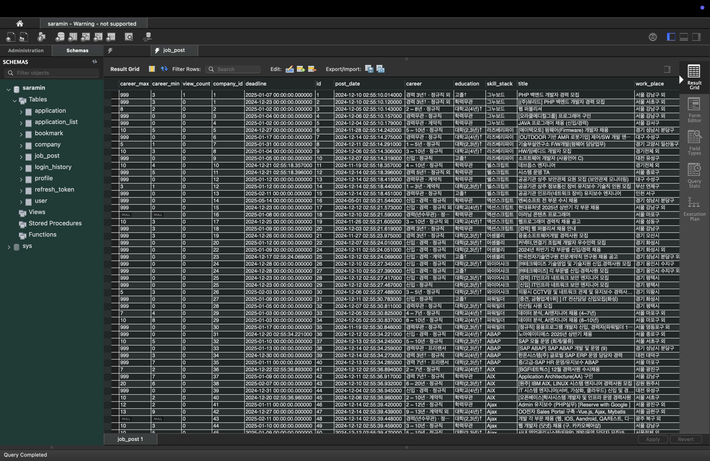
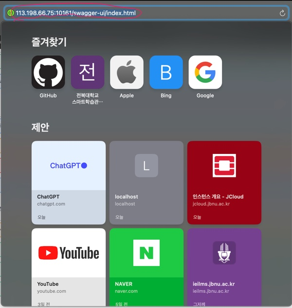
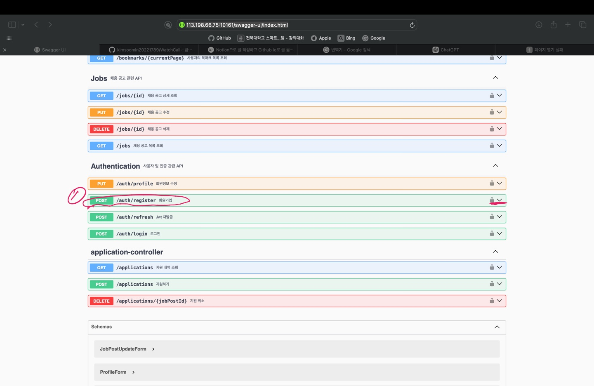
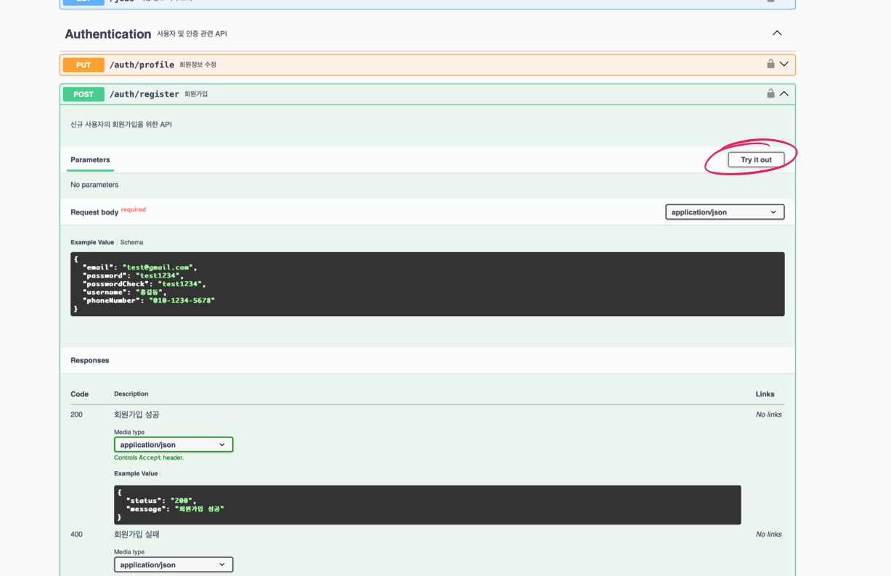
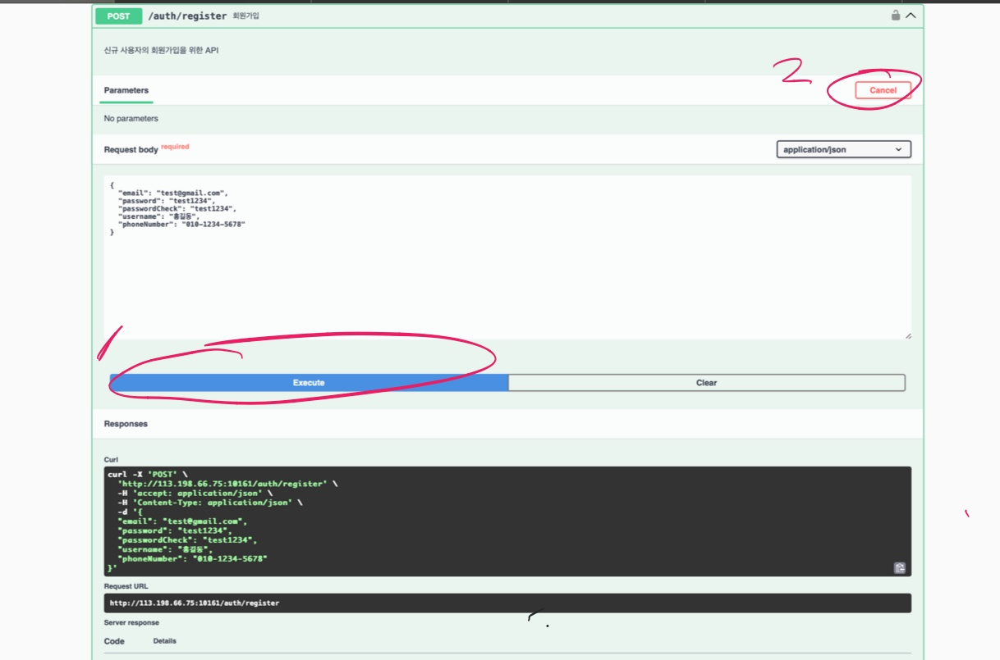
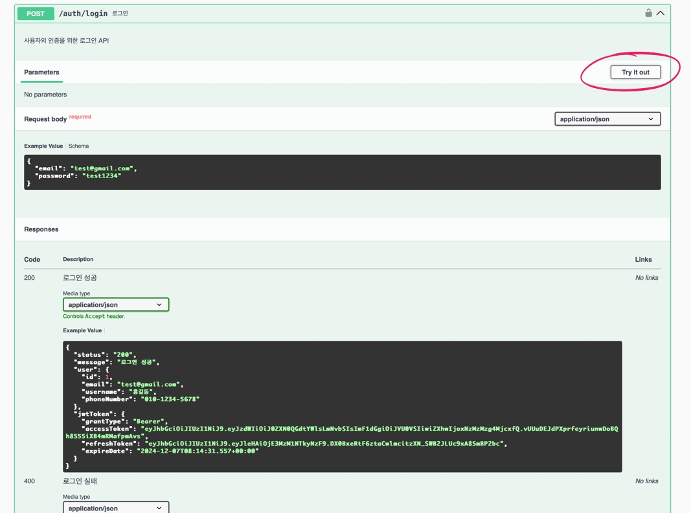
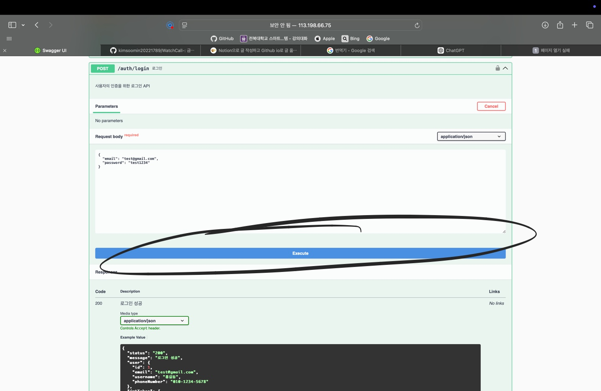
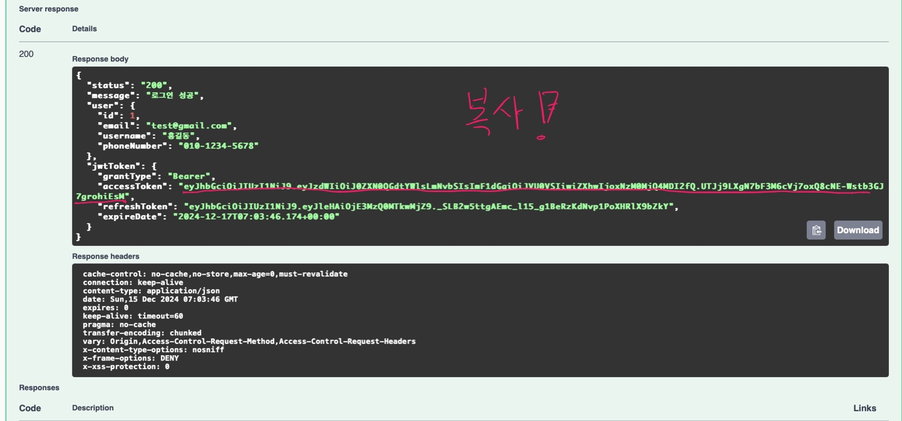
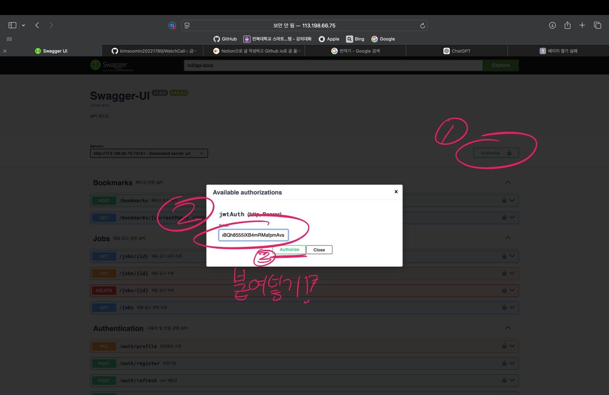
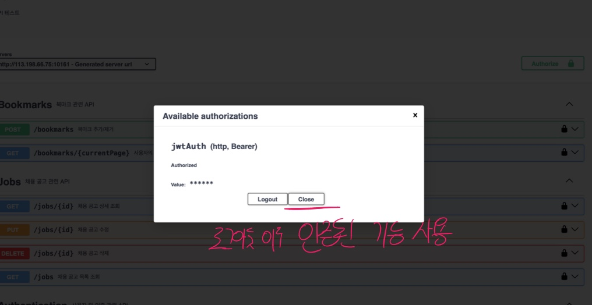

# 📌구인구직 백엔드 서버 만들기(사람인..?)📌

## 🔨Spring Boot Project

### ✅Version

- Spring Boot version : '3.4.0'
- MySQL version : '8.0.0'
- java version : '17'

---

- 웹 크롤링 이해 및 적용 : 사람인에서 채용 공고 데이터를 크롤링하여 수집.
- 데이터베이스 설계 : 크롤링한 데이터를 MySQL로 구조화
- REST API 개발 : 크롤링한 데이터를 기반으로 한 다양한 기능의 API 개발 및 회원 인증 기능 구현
- 문서화 및 인증 : Swagger를 이용한 API 문서화와 JWT 기반 인증 시스템 적용.
- 클라우드 배포 : JCloud를 사용하여 백엔드 서버 배포

---

## ✅ubuntu ssh 접속
```cpp
ssh -i ~/.ssh/MSEOK-saramin.pem ubuntu@113.198.66.75 -p 19161
```

---

## ✅docker && MySQL 

### docker 컨테이너 생성

- 컨테이너 실행 및 존재 여부 확인

```cpp
sudo docker ps -a
```

- 컨테이너 생성 및 실행

```cpp
sudo docker run -d —name saramin -e MYSQL_ROOT_PASSWORD=1234 -e MYSQL_DATABASE=saramin -p 3306:3306 -d [이미지 이름 : 228d71078f8c] or [컨테이너 이름 : saramin] --skip-ssl
```

- 생성되어있다면? 기존의 컨테이너 실행

```cpp
sudo docker start [이미지 이름 : 228d71078f8c] or [컨테이너 이름 saramin]
[비밀번호 : 1234]
```
---

## ✅build 명령어

1. 의존성 다운로드 및 빌드 및 JAR실행 파일 생성

```cpp
./gradlew bootjar
```

1. 빌드된 JAR 파일로 실행

```cpp
java -jar build/libs/saramin-0.0.1-SNAPSHOT.jar
```

OR

```cpp
nohup java -jar saramin-0.0.1-SNAPSHOT.jar //백그라운드 실행시 사용
```

---

## 📁프로젝트 구조

```cpp
saramin/          
├── src/
│   ├── main/                   
│   │   ├── java/                
│   │   │   └── com/
│   │   │       └── example/
│   │   │           └── saramin/
│   │   │               ├── auth/
│   │   │               │ 	├── Base64PasswordEncoder.java 
│   │   │               │ 	├── JwtAuthenticationFilter.java
│   │   │               │ 	├── JwtToken.java
│   │   │               │ 	├── JwtTokenProvider.java
│   │   │               │ 	├── PrincipalDetails.java
│   │   │               │ 	└── PrincipalDetailsService.java
│   │   │               │
│   │   │               ├── config/
│   │   │               │ 	├── SwaggerConfig.java
│   │   │               │ 	├── WebConfig.java
│   │   │               │ 	└── WebSecurityConfig.java
│   │   │               │ 	
│   │   │               ├── controller/
│   │   │               │ 	├── application
│   │   │               │ 	│   ├── ApplicationController.java
│   │   │               │   │   └── ApplicationControllerDocs.java
│   │   │               │ 	├── authentication/
│   │   │               │ 	│   ├── Authentication.java
│   │   │               │   │   └── AuthenticationDocs.java
│   │   │               │ 	├── bookmark/
│   │   │               │ 	│   ├── BookmarkController.java
│   │   │               │   │   └── BookmarkControllerDocs.java
│   │   │               │   └── jobPost/
│   │   │               │ 	    ├── jobPostController.java
│   │   │               │       └── jobPostControllerDocs.java
│   │   │               │ 
│   │   │               ├── customException/
│   │   │               │ 	├── customException.java
│   │   │               │   └── customExceptions.java
│   │   │               │          
│   │   │               ├── entitiy/                     
│   │   │               │ 	├── dto/
│   │   │               │ 	│   ├── Application/
│   │   │               │ 	│   │   ├── ApplicationForm.java
│   │   │               │   │   │   └── ApplicationResponse.java
│   │   │               │ 	│   ├── Authentication/
│   │   │               │ 	│   │   ├── LoginForm.java
│   │   │               │ 	│   │   ├── ProfileForm.java
│   │   │               │ 	│   │   ├── RegisterForm.java
│   │   │               │   │   │   └── UserDto.java
│   │   │               │   │   └── JobPost
│   │   │               │ 	│       ├── JobPostDto.java
│   │   │               │ 	│       ├── JobPostdRequest.java
│   │   │               │ 	│       ├── JobPostRsponse.java
│   │   │               │ 	│       ├── JobPostUpdateForm.java
│   │   │               │   │       └── JobRequestForm.java
│   │   │               │   │
│   │   │               │ 	├── model/
│   │   │               │ 	│   ├── Application.java
│   │   │               │ 	│   ├── Bookmark.java
│   │   │               │ 	│   ├── Company.java
│   │   │               │ 	│   ├── JobPost.java
│   │   │               │ 	│   ├── LoginHistory.java
│   │   │               │ 	│   ├── Profile.java
│   │   │               │ 	│   ├── RefreshToken.java
│   │   │               │   │   └── User.java
│   │   │               │   └── UserRole.java
│   │   │               │
│   │   │               ├── logging/
│   │   │               │ 	├── loggingInterceptor.java
│   │   │               │   └── PerformanceTest.java
│   │   │               │
│   │   │               ├── repository/
│   │   │               │ 	├── ApplicationRepository.java
│   │   │               │ 	├── BookmarkRepository.java
│   │   │               │ 	├── CompanyRepository.java
│   │   │               │   ├── JobPostRepository.java
│   │   │               │   ├── LoginHistoryRepository.java
│   │   │               │   ├── ProfileRepository.java
│   │   │               │   ├── RefreshTokenRepository.java
│   │   │               │   └── UserRepository.java
│   │   │               │
│   │   │               ├── service/                    
│   │   │               │ 	├── ApplicationService.java
│   │   │               │ 	├── BookmarkService.java
│   │   │               │ 	├── CompanyService.java
│   │   │               │ 	├── JobPostService.java
│   │   │               │ 	├── RefreshTokenService.java
│   │   │               │   └── UserService.java
│   │   │               │
│   │   │               ├── util/
│   │   │               │ 	├── Base64Encoder.java
│   │   │               │ 	├── CarrerConverter.java
│   │   │               │ 	├── CrawlerValidator.java
│   │   │               │ 	├── DataBarser.java                  
│   │   │               │   └── FormValidator.java
│   │   │               │
│   │   │               ├── GlobalExceptionHandler.java
│   │   │               └── SaraminApplication.java
│   │   │                   
│   │   └── resources/         
│   │       └── application.yml
│   └── test/                     
│       └── java/                  
│           └── com/
│               └── example/
│                   └── saramin/  
│                       └── SaraminApplicationTests.java
├── gitattributes
├── .gitignore
├── crawled-data.sql
├── saramin-0.0.1-SNAPSHOT.jar
├── build.gradle                  
├── settings.gradle               
├── gradlew                      
├── gradlew.bat                   
└── README.md                     

```

---

## 📖DataBase


---

## 🔗URL

[http://113.198.66.75:10161/swagger-ui/index.html](http://113.198.66.75:10161/swagger-ui/index.html)

## 📄회원가입 및 로그인

### URL 접속


### 회원가입 - 1


### 회원가입 - 2


### 회원가입 - 3


### 회원가입 - 4


### 로그인 - 1


### 로그인(토큰복사) - 2


### Authorize - 1


### Authorize - 2


---

## 🔐Authorize

## Authorize 전 이용 가능

### Authentication 사용자 및 인증 관련 API

- /auth/profile
- /auth/register
- /auth/refresh
- /auth/login

### Jobs 채용 공고 관련 API

- /jobs
- /jobs/{id}

---

## Authorize 후 이용 가능

### Bookmarks 북마크 관련 API 

- /bookmarks/{id}
- /bookmarks/{currentPage}

### application-controller

- /application-controller/getApplications/{id}
- /application-controller/applications/{id}
- /application-controller/applications/{jobpostId}
- 


